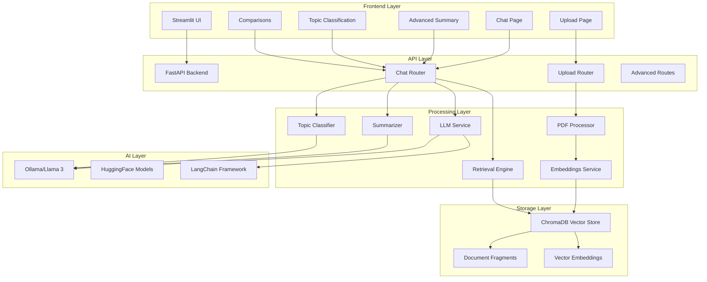
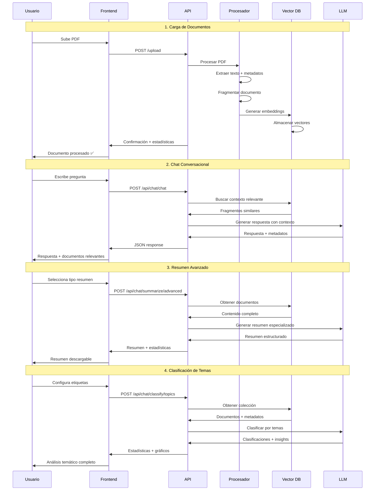
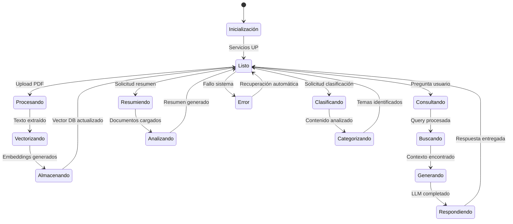

# 📚 Copiloto Conversacional con IA

Un sistema completo de análisis de documentos PDF usando **IA local** con capacidades avanzadas de resumen, clasificación temática y chat conversacional.

## 🏗️ Arquitectura del Sistema



### Componentes Principales

#### 🖥️ **Frontend (Streamlit)**
- **Interfaz Web Intuitiva**: 6 páginas especializadas
- **Upload de Documentos**: Procesamiento PDF en tiempo real
- **Chat Conversacional**: Interfaz de preguntas y respuestas
- **Resumen Avanzado**: 4 tipos de resumen configurables
- **Clasificación de Temas**: Análisis automático por categorías
- **Comparaciones**: Análisis comparativo entre documentos

#### ⚡ **Backend (FastAPI)**
- **API RESTful**: 13 endpoints especializados
- **Procesamiento Asíncrono**: Manejo eficiente de archivos grandes
- **Gestión de Estado**: Control de conexiones y errores
- **Validación de Datos**: Modelos Pydantic para requests/responses
- **Documentación Automática**: Swagger UI integrado

#### 🧠 **Servicios de IA**
- **LLM Local**: Integración con Ollama/Llama 3 via LangChain
- **Embeddings**: Transformers de HuggingFace para vectorización
- **Resumen Inteligente**: 4 tipos especializados (Ejecutivo, Técnico, Completo, Puntos Clave)
- **Clasificación Temática**: Zero-shot classification con 15+ categorías
- **Búsqueda Semántica**: Recuperación contextual de información

#### 🗄️ **Almacenamiento Vectorial**
- **ChromaDB**: Base de datos vectorial persistente
- **Fragmentación Inteligente**: División óptima de documentos
- **Indexación Semántica**: Búsqueda por similitud
- **Metadatos Estructurados**: Información de documentos y páginas

## 🛠️ Justificación de Tecnologías

### **¿Por qué estas tecnologías?**

| Tecnología | Justificación | Alternativas Pagadas |
|------------|---------------|---------------------|
| **FastAPI** | Framework Python moderno, async nativo, documentación automática, alto rendimiento | - |
| **Streamlit** | Desarrollo rápido de interfaces, integración Python nativa, componentes ricos | Plotly Dash Pro |
| **ChromaDB** | Base vectorial open-source, fácil integración, persistencia local | Pinecone, Weaviate Cloud |
| **HuggingFace** | Modelos pre-entrenados gratuitos, comunidad activa, transformers optimizados | OpenAI Embeddings |
| **Ollama** | LLMs locales gratuitos, privacidad total, sin límites de API | OpenAI GPT-4, Claude |
| **LangChain** | Framework de IA, chains pre-construidas, memoria conversacional | - |
| **Docker** | Portabilidad, aislamiento, reproducibilidad, orquestación simple | - |
| **PyMuPDF** | Procesamiento PDF robusto, extracción de metadatos, gratuito | Adobe PDF Services |

### **💰 Ventajas Económicas**
- **🆓 100% Gratuito**: Sin costos de API ni suscripciones
- **🔒 Privacidad Total**: Datos nunca salen de tu infraestructura
- **📈 Escalabilidad**: Sin límites de tokens o requests
- **🚀 Performance**: Procesamiento local optimizado

## 🚀 Instrucciones de Ejecución

### **Prerrequisitos**
```bash
# Instalar Docker y Docker Compose
# Windows: Docker Desktop
# Linux: sudo apt install docker.io docker-compose
# macOS: Docker Desktop

# Verificar instalación
docker --version
docker-compose --version
```

### **Instalación y Ejecución**

1. **Clonar el repositorio**
```bash
git clone https://github.com/Cristian-Soto/copiloto-conversacional.git
cd copiloto-conversacional
```

2. **Configurar variables de entorno (opcional)**
```bash
# Copiar archivo de ejemplo
cp .env.example .env

# Editar configuraciones si es necesario
# Por defecto funciona sin modificaciones
```

3. **Iniciar el sistema completo**
```bash
# Construir e iniciar todos los servicios
docker-compose up -d

# Ver logs en tiempo real (opcional)
docker-compose logs -f

# Verificar estado de contenedores
docker-compose ps
```

4. **Acceder a las aplicaciones**
```
Frontend (Streamlit): http://localhost:8501
Backend API:          http://localhost:8000
Documentación API:    http://localhost:8000/docs
Health Check:         http://localhost:8000/api/chat/health
```

### **Comandos Útiles**
```bash
# Detener servicios
docker-compose down

# Reconstruir después de cambios
docker-compose up --build

# Ver logs específicos
docker-compose logs backend
docker-compose logs frontend

# Limpiar sistema (elimina datos)
docker-compose down -v
```

## 💬 Flujo Conversacional



### **Estados del Sistema**



## 🎯 Características Principales

### **🤖 IA Avanzada**
- **4 Tipos de Resumen**: Ejecutivo, Técnico, Completo, Puntos Clave
- **Clasificación Inteligente**: 15+ categorías temáticas automáticas
- **Chat Contextual**: Memoria conversacional con LangChain
- **Análisis Comparativo**: Comparación semántica entre documentos
- **Fallbacks Inteligentes**: Funciona con/sin LLM local

### **📊 Análisis de Documentos**
- **Procesamiento PDF**: Extracción completa de texto y metadatos
- **Fragmentación Inteligente**: División óptima para mejores embeddings
- **Búsqueda Semántica**: Recuperación por similitud vectorial
- **Insights Automáticos**: Análisis de diversidad y patrones temáticos

### **🔧 Características Técnicas**
- **APIs RESTful**: 13 endpoints especializados
- **Dockerizado**: Despliegue en un comando
- **Escalable**: Arquitectura modular y extensible
- **Monitorizable**: Health checks y logging integrado

## ⚠️ Limitaciones Actuales

### **🔴 Limitaciones Técnicas**
1. **Formato de Archivos**: Solo PDF (próximamente: DOCX, TXT, EPUB)
2. **Idioma Principal**: Optimizado para español (inglés funcional)
3. **Tamaño de Archivo**: Recomendado <50MB por PDF
4. **LLM Opcional**: Algunas funciones requieren Ollama para mejor calidad
5. **Memoria Conversacional**: Limitada a sesión actual (no persistente)

### **🟡 Limitaciones de Rendimiento**
1. **Procesamiento Inicial**: PDFs grandes pueden tomar 2-5 minutos
2. **Memoria RAM**: Recomendado 8GB+ para documentos grandes
3. **Almacenamiento**: Base vectorial crece ~10MB por documento procesado
4. **Concurrencia**: Optimizado para uso individual/pequeños equipos

### **🟠 Limitaciones de IA**
1. **Calidad LLM**: Dependiente de modelo Ollama disponible
2. **Clasificación**: Limitada a categorías predefinidas
3. **Multiidioma**: Mejor rendimiento en español
4. **Precisión Semántica**: Variable según complejidad del documento

## 🗺️ Roadmap de Desarrollo

### **📅 Próximas Versiones**

#### **v1.1 - Expansión de Formatos (Q3 2025)**
- [ ] Soporte para DOCX, TXT, EPUB
- [ ] Procesamiento de imágenes en PDFs (OCR)
- [ ] Extracción de tablas y gráficos
- [ ] Metadatos extendidos

#### **v1.2 - IA Mejorada (Q4 2025)**
- [ ] Integración HuggingFace zero-shot classification
- [ ] Modelos multiidioma mejorados
- [ ] Resumen automático por capítulos
- [ ] Detección automática de idioma

#### **v1.3 - Colaboración (Q1 2026)**
- [ ] Persistencia de conversaciones
- [ ] Sistema de usuarios múltiples
- [ ] Compartir documentos y análisis
- [ ] Workspace colaborativo

#### **v1.4 - Análisis Avanzado (Q2 2026)**
- [ ] Análisis de sentimientos
- [ ] Extracción de entidades nombradas
- [ ] Generación automática de preguntas
- [ ] Mapas conceptuales automáticos

#### **v1.5 - Integración Empresarial (Q3 2026)**
- [ ] APIs para integración empresarial
- [ ] Conectores para SharePoint/OneDrive
- [ ] Workflows automatizados
- [ ] Dashboard analítico avanzado

### **🔮 Visión a Largo Plazo**
- **🌐 Multi-tenant**: SaaS deployable
- **📱 Mobile Apps**: iOS/Android nativo
- **🔗 Integraciones**: Office 365, Google Workspace, Slack
- **🎯 IA Especializada**: Modelos fine-tuned por industria
- **🚀 Edge Deployment**: Kubernetes, cloud-native

## 📋 Estructura del Proyecto

```
copiloto-conversacional/
│
├── 🐳 Docker & Configuración
│   ├── docker-compose.yml          # Orquestación completa
│   ├── .env.example               # Variables de entorno
│   └── .gitignore                 # Archivos excluidos
│
├── 🔧 Backend (FastAPI)
│   ├── app/
│   │   ├── main.py                # Aplicación principal
│   │   ├── routers/               # Endpoints API
│   │   │   ├── upload.py          # Carga de documentos
│   │   │   └── chat.py            # Chat y funciones IA
│   │   ├── services/              # Lógica de negocio
│   │   │   ├── pdf_processing.py  # Procesamiento PDF
│   │   │   ├── embeddings.py      # Generación de embeddings
│   │   │   ├── vector_store.py    # ChromaDB integration
│   │   │   ├── retrieval.py       # Búsqueda semántica
│   │   │   ├── llm_service.py     # LangChain + Ollama
│   │   │   ├── summarizer.py      # Resumen avanzado
│   │   │   └── topic_classifier.py # Clasificación temática
│   │   └── models/                # Modelos de datos
│   │       ├── request_models.py  # Requests Pydantic
│   │       └── response_models.py # Responses Pydantic
│   ├── requirements.txt           # Dependencias Python
│   └── Dockerfile                # Imagen backend
│
├── 🎨 Frontend (Streamlit)
│   ├── streamlit_app.py           # Aplicación principal
│   ├── requirements.txt           # Dependencias frontend
│   └── Dockerfile                # Imagen frontend
│
└── 📚 Documentación
    ├── README.md                  # Este archivo
    └── tests/                     # Tests automatizados
```

## 🤝 Contribución

1. Fork el proyecto
2. Crea una rama feature (`git checkout -b feature/nueva-funcionalidad`)
3. Commit tus cambios (`git commit -m 'Agregar nueva funcionalidad'`)
4. Push a la rama (`git push origin feature/nueva-funcionalidad`)
5. Abre un Pull Request

## 📄 Licencia

Este proyecto está bajo la Licencia MIT - ver el archivo [LICENSE](LICENSE) para detalles.

## 🆘 Soporte

- **Issues**: [GitHub Issues](https://github.com/Cristian-Soto/copiloto-conversacional/issues)
- **Documentación**: [API Docs](http://localhost:8000/docs) (cuando esté ejecutándose)
- **Discussions**: [GitHub Discussions](https://github.com/Cristian-Soto/copiloto-conversacional/discussions)

---

**⚡ Construido con tecnologías 100% gratuitas para democratizar el acceso a IA avanzada**